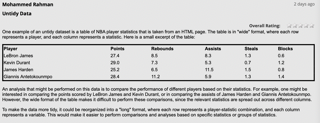

```{r global_options, include=FALSE}
knitr::opts_chunk$set(eval = TRUE, message = FALSE, warning = FALSE)
library(tidyverse)
library(openintro)
```

```{r}
knitr:: 
```


# untidy data posted by mohammed ramadan in discussion 5 

One example of an untidy dataset is a table of NBA player statistics that is taken from an HTML page. The table is in "wide" format, where each row represents a player, and each column represents a statistic. 


An analysis that might be performed on this data is to compare the performance of different players based on their statistics. For example, one might be interested in comparing the points scored by LeBron James and Kevin Durant, or in comparing the assists of James Harden and Giannis Antetokounmpo. However, the wide format of the table makes it difficult to perform these comparisons, since the relevant statistics are spread out across different columns.

```{r}
library(RMySQL)
con <- dbConnect(MySQL(),
                 host = "localhost",
                 username = "root",
                 password = "Alex9297248844",
                 dbname = "Project2")


```


```{r}
con <- dbGetQuery(con, "SELECT * FROM player_stats ")
```

```{r}
print (con)
```

Tidy and transform the data

```{r}
# convert the data from wide format to long format

library(tidyr)

df <- con %>%
  pivot_longer(cols = c("points", "rebounds", "assists", "steals", "blocks"),
               names_to = "statistic",
               values_to = "value")

```


```{r}
print(df)
```


using dplyr to filter the data and compare the points scored by LeBron James and Kevin Duran

```{r}
library(dplyr)

df %>%
  filter(player %in% c("LeBron James", "Kevin Durant"), statistic == "points") %>%
  select(player, value)

```

bar charts to compare the mean values of different statistics for each player

```{r}
library(ggplot2)

ggplot(df, aes(x = player, y = value, fill = statistic)) +
  geom_bar(stat = "identity", position = "dodge") +
  labs(x = "Player", y = "Value", fill = "Statistic") +
  theme_minimal()

```


 box plots to compare the distribution of different statistics for each player

```{r}
ggplot(df, aes(x = player, y = value, fill = statistic)) +
  geom_boxplot() +
  labs(x = "Player", y = "Value", fill = "Statistic") +
  theme_minimal()

```


```{r}
# Filter the data to include only LeBron James and Kevin Durant
data_subset <- df %>%
  filter(player %in% c("LeBron James", "Kevin Durant"))

# Perform a two-sample t-test to compare the mean points scored between the two players
t.test(value ~ player, data = data_subset, var.equal = TRUE)

```

the p-value of 0.94 suggests that there is not a significant difference in the means of the two groups, and the confidence interval (-16.95, 15.91) includes zero, which also supports this conclusion.

##### conculution 

I compared the performance of different players based on their statistics, specifically focusing on the points scored by LeBron James and Kevin Durant. I also used visualizations to compare the mean values and distribution of different statistics for each player,also performed a two-sample t-test to determine whether there was a significant difference in the mean points scored between LeBron James and Kevin Durant.


*** 

# Untidy data posted by Coco Donovan in discussion 5

sources: 
[untidy data ](  https://towardsdatascience.com/whats-tidy-data-how-to-organize-messy-datasets-in-python-with-melt-and-pivotable-functions-5d52daa996c9 )


```{r}
knitr:: 
```


As far as analysis goes you could group by religion and see what the religious makeup of all respondents was by percentages. This is also just an idea, but it could be helpful to conduct a visual analysis with parallel bar charts to get and idea of which religion has the wealthiest followers (based solely on the results of this data)


##### Data cleanup

```{r}

library(RMySQL)
# Connect to the database using the environment variables
coco<- dbConnect(MySQL(),
                 host = "localhost",
                 username = "root",
                 password = "Alex9297248844",
                 dbname = "Project2")
```

```{r}
coco <- dbGetQuery(coco, "SELECT * from religion_survey")
```

```{r}
knitr::kable(coco)
```

##### Tidy and transform the data using tidyr and dplyr

```{r}
library(tidyverse)
library(dplyr)
```


 drop id column
```{r}
coco_new <- select(coco, -id)

```

```{r}
knitr::kable(coco_new)
```

##### Convert the data from wide format to long format using

```{r}
coco_tidy <- coco_new %>%
  pivot_longer(cols = -religion, names_to = "income_level", values_to = "count") %>%
  mutate(income_level = gsub("income_", "", income_level)) %>%
  arrange(religion, income_level)

head (coco_tidy)
```
```{r}
summary(coco_tidy)
```

Replace all occurrences of "refused" in the income_level column with NA, creating a tidy dataset where all values are of the same type and format.
```{r}
coco_tidy <- coco_tidy %>%
  mutate(income_level = replace(income_level, income_level == "refused", NA))

```

```{r}
head(coco_tidy)

```

```{r}
library(dplyr)
library(ggplot2)

# group data by religion and income level, calculate percentage of respondents
data_summary <- coco_tidy %>%
  group_by(religion, income_level) %>%
  summarize(count = sum(count)) %>%
  mutate(percent = count/sum(count) * 100)

```

```{r}
head(data_summary)
```


```{r}

# create parallel bar chart
ggplot(data_summary, aes(x = income_level, y = percent, fill = religion)) +
  geom_bar(stat = "identity", position = "dodge") +
  labs(title = "Income Distribution by Religion",
       x = "Income Level", y = "Percentage of Respondents") +
  theme_bw()

```

```{r}
summary(data_summary)
```


```{r}
# Create the stacked bar chart
ggplot(data_summary, aes(x = religion, y = percent, fill = income_level)) +
  geom_bar(stat = "identity", position = "stack") +
  theme(axis.text.x = element_text(angle = 90)) +
  labs(title = "Wealth Distribution by Religion", x = "Religion", y = "Percentage", fill = "Income Level")
```

*** 

# Untidy data posted by Farhana Akther in discussion 5

```{r}
knitr:: 
```


The table above reports vote counts for two US states, California and Florida. In this table, the column names CA and FL are values of the variable state. Therefore, we can say that this table is in an untidy format.

As per analysis, we can compare the vote counts in each state vs candidate. We can also “melt” the table and transform into a long format and tidy the table so that further analysis can be done; including plotting functions, hypothesis testing functions, and modeling functions such as linear regression.

[Source]( https://gagneurlab.github.io/dataviz/tidy-data-and-combining-tables.html)


##### Data cleanup

```{r}
library(RMySQL)
Farhana<- dbConnect(MySQL(),
                 host = "localhost",
                 username = "root",
                 password = "Alex9297248844",
                 dbname = "Project2")

```


```{r}
Farhana <- dbGetQuery(Farhana, "SELECT * FROM election_results ")
```


```{r}
knitr::kable(Farhana)
```


Upload requied packages 

```{r}
library(tidyverse)
library(dplyr)

```


##### Convert the data from wide to long format

```{r}
election_data <-Farhana %>%
  pivot_longer(cols = c(CA, FL), names_to = "state", values_to = "votes")

```


```{r}
knitr::kable(election_data)
```


##### Analysis
 
 Calculate the total votes for each candidate
 
```{r}
total_votes <- election_data %>%
  group_by(candidate) %>%
  summarize(total_votes = sum(votes))

```

Join the total votes to the long format data frame

```{r}
long_election_data <- election_data %>%
  left_join(total_votes, by = "candidate")

```


```{r}
knitr::kable(long_election_data)
```


Bar plot of the vote counts for each candidate in each state

```{r}
library(ggplot2)

ggplot(long_election_data, aes(x = state, y = votes, fill = candidate)) +
  geom_col(position = "dodge") +
  labs(title = "Vote Counts by State and Candidate",
       x = "State", y = "Votes",
       fill = "Candidate")

```


```{r}
summary(long_election_data)
```


I will use linear regression to model the relationship between the vote counts for each candidate in California and Florida:

```{r}
# Fit a linear regression model to the data
lm_model <- lm(votes ~ state + candidate, data = long_election_data)

# View the model summary
summary(lm_model)

```


Based on the linear regression analysis, we can see that the coefficients for the candidate variables are all significant with p-values less than 0.05, except for the stateFL variable which is not significant. This suggests that the candidate chosen had a significant effect on the number of votes received, while the state did not have a significant effect. The R-squared value of 0.9509 indicates that the model explains a high proportion of the variance in the data, and the F-statistic of 14.53 with a p-value of 0.02639 suggests that the model is statistically significant. Overall, the analysis suggests that the choice of candidate had a significant impact on the number of votes received, while the state did not have a significant effect.


